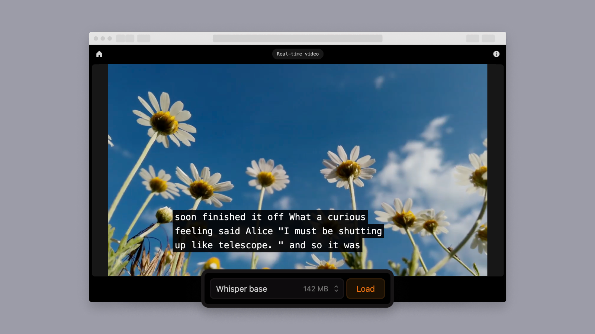

# Amazon IVS WebGPU Captions Demo

A demo web application that showcases state-of-the-art client-side transcription, with everything running directly in your browser. By leveraging [Transformers.js
](https://github.com/xenova/transformers.js) and [ONNX Runtime Web](https://github.com/microsoft/onnxruntime), this demo enables [WebGPU](https://github.com/gpuweb/gpuweb)-accelerated real-time in-browser transcription for Amazon IVS Low-latency and Real-time streams.



> [!WARNING]  
> This is an experimental demo designed exclusively for educational purposes. By using this solution, you understand and accept its risks and limitations.

## Prerequisites

- A [WebGPU](https://github.com/gpuweb/gpuweb) capable device.
- [NodeJS](https://nodejs.org/) `v20.10.0` and Node package manager (npm).
  - If you have [node version manager](https://github.com/nvm-sh/nvm) installed, run `nvm use` to sync your node version with this project.
- `API_URL` from the deployed serverless infrastructure for this demo.
- [AWS CLI Version 2](https://docs.aws.amazon.com/cli/latest/userguide/install-cliv2.html)
- Access to an AWS Account with at least the following permissions:
  - Create IAM roles
  - Create Lambda Functions
  - Create Amazon IVS Stages
  - Create Amazon S3 Buckets
  - Create Cloudfront Distributions

## Running the demo

Follow these instructions to run the demo:

### Deploy backend infrastructure

1. Initialize the infrastructure: `npm run deploy:init`
2. Deploy the backend stack: `npm run deploy:backend`

For more details, review the [Amazon IVS WebGPU Captions Demo Serverless Infrastructure](./infra/README.md)

### Run client app

1. Run: `npm ci`
2. Run: `npm run dev`

### Deploy client app

The following command will deploy the client website to a public cloudfront url.

1. Run: `npm run deploy:website`

### Replace the low-latency IVS stream

Replace the `PLAYBACK_URL` in [src/constants.js](./src/constants.js#L3) with your IVS Playback URL.

### Customize the available models

Modify the `SAMPLE_MODELS` in [src/constants.js](./src/constants.js#L13) to add or remove the models shown in the UI. Additional models may be found in the [Hugging Face ONNX Community](https://huggingface.co/onnx-community).

```
{
  label: 'Model name'
  description: 'A short description of the model.',
  value: 'huggingface_model_name', // for example, 'onnx-community/whisper-tiny.en'
  sizeInBytes: Model size,
  modelOptions: {
    dtype: {
      encoder_model: 'q4', // 'q4' or 'q8' or 'fp16 or 'fp32' (values may not work with all models)
      decoder_model_merged: 'q4', // 'q4' or 'q8' or 'fp16 or 'fp32' (values may not work with all models)
    },
    device: 'webgpu', // or 'wasm'
  },
},
```

## Known issues and limitations

- The application is meant for demonstration purposes and **not** for production use.
- This application is only tested and supported on browsers and devices that support WebGPU. Other browsers and devices, including mobile browsers and smartphones, may work with this tool, but are not officially supported at this time.
- Muting a low-latency video will stop captions from being generated. Real-time videos do not have this issue.
- In some cases, the application may experience a memory leak (seems related to https://github.com/xenova/transformers.js/issues/860)

## About Amazon IVS

Amazon Interactive Video Service (Amazon IVS) is a managed livestreaming and stream chat solution that is quick and easy to set up, and ideal for creating interactive video experiences. [Learn more](https://aws.amazon.com/ivs/).

- [Amazon IVS docs](https://docs.aws.amazon.com/ivs/)
- [User Guide](https://docs.aws.amazon.com/ivs/latest/userguide/)
- [API Reference](https://docs.aws.amazon.com/ivs/latest/APIReference/)
- [Setting Up for Streaming with Amazon Interactive Video Service](https://aws.amazon.com/blogs/media/setting-up-for-streaming-with-amazon-ivs/)
- [Learn more about Amazon IVS on IVS.rocks](https://ivs.rocks/)
- [View more demos like this](https://ivs.rocks/examples)
